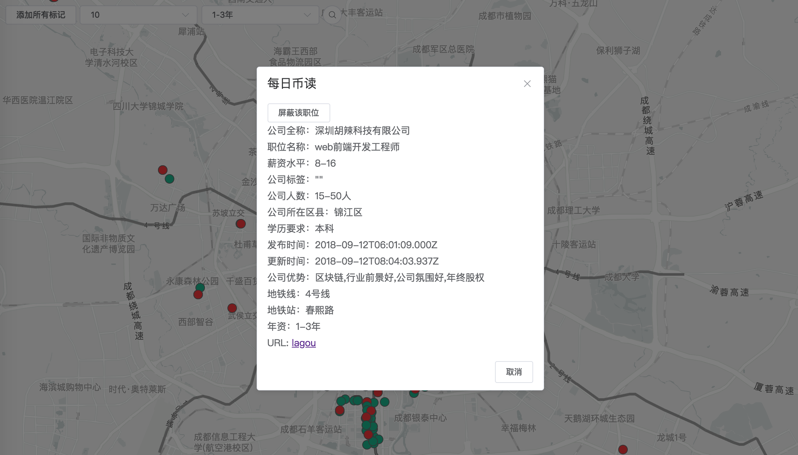

[](https://github.com/shoyuf/shoyuf-job)


## SHOYUF-JOB

一个基于 Egg (Koa2) 开发的职位爬虫

### 平台支持

| 拉勾Lagou | Boss直聘 |
| - | - |
| ✔ | ✔ |

### 功能完整程度

- [x] 基础爬取功能
- [x] 地图展示
- [x] 定时任务
- [x] 数据库字段文档
- [ ] 爬虫进度
- [ ] 配置文件
- [x] 其他招聘网站
- [ ] 单元测试
- [ ] 代码部署
- [ ] 优化代码
- [ ] JSDoc
- [ ] APIDoc

### 界面



### 使用调试

`Node.js` 版本大于 `8.11.x` ，建议使用 `Yarn`

执行 `yarn dev`

### 常见问题

- 如何使用爬虫程序

  1. 启动应用
  2. 抓取 Boss 直聘微信小程序任意接口Session（ Boss 直聘需要 Session ）
  3. 进入 `/monitor` 输入 Session 点击开始

  原因：Boss 直聘官网仅有十页且反爬程序稍微复杂需要用到代理池，故先采用小程序接口优化体验

- 如何查找其他职位和其他城市信息

  *在 `app/schedule/lagou.js` 中修改相关字段，如 `成都` 或 `web前端`*

- 如何配置数据库
  
  *本项目默认使用 `MongoDB` 存储，需要在 `config` 目录下建立 `secret_config.js` 文件，并输入如下数据，如有其他适配（如数据库验证）还需修改 `app/service/mongodb.js` 的内容*

  ```js
  module.exports = {
    cookieKeyStr: 'cookieKeyStr', // Cookie 密钥
    database: {
      url: 'mongodb://mongo:27017', // MongoDB 数据库链接地址
      baseName: 'job', // MongoDB Collection 名称
      auth: { // 认证相关
        authSource: 'admin',
        user: 'user',
        password: 'password',
      },
    },
  };
  ```

- API 来源
  拉勾 | Boss直聘
  - | -
  Web | WeChat Mini Program

 
### 鸣谢

- [Egg](https://eggjs.org/)
- [MongoDB](https://www.mongodb.com/)
- [axios](https://github.com/axios/axios)
- [Element](https://element-cn.eleme.io/)

### License

MIT
